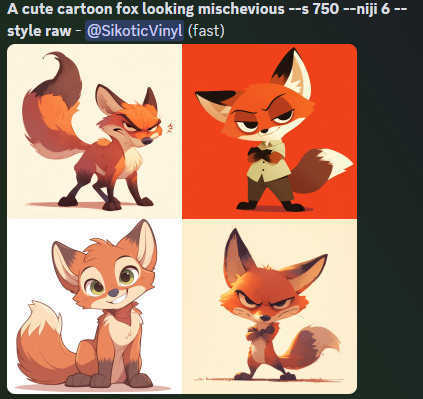

# MidJourney Case Study

*A simple case study of MidJourney*

## Overview and Origin

* **Company:** [MidJourney](https://www.midjourney.com/home)

* **Incorporated:** 2021 in San Francisco, CA.

* **Founder:**  David Holz

* **Inspiration**
> David's vision for MidJourney stemmed from a lifelong fascination with exploring the creative potential of computers. Holz continues to shape MidJourney following his ethics and creativity and watching it all grow with collaboration between humans and AI.

* **Funding:** Having experience from being a co-founder for Leap Motion as well as other prior entrepreneurial ventures, David self-funded the project from its roots and now they are seeing around $200 million in annual revenue - all without investor funding. A good portion of its revenue is continually reinvested back into the company.

## Business Activities

* **MidJorurney's Goals** From listening to David during the weekly office hours on [Discord](https://discord.gg/midjourney), it's clear that MidJourney is a passion project aimed at enabling everyone to express their creativity. As an independent research lab, MidJourney's commitment is evident in the way their model processes images and emotions, focusing on creating 'vibey' and evocative outputs. The team's dedication to this artistic vision is palpable. Currently, they are developing a web solution to make their AI accessible outside of Discord, further expanding its reach and impact.

* **MidJourney's Client Base** This specific Ai focuses on text to image generation and is aimed for creativity and vibe. David wants the ability to express creativity in imagry to be more available to everyone and is against the idea of gate keeping being creative.

* **MidJourney's Advantage** MidJourney is very different from other text to image models out there like DALL E 3, Gemini and others as it has put a big focus on "vibe" - capturing feelings and sensations within their images. It can be hard to explain but easy to show when you use the same prompt on each model and get vastly different responses. You need less to get more with MidJourney

  <h3>Example Prompt: A cute cartoon fox looking mischievous</h3>
  <ul style="list-style-type:none;">
  <li style="display:inline-block; text-align:center; margin-right:20px;">
    <h4>Dall-E 3</h4>
    
  </li>
  <li style="display:inline-block; text-align:center;">
    <h4>MidJourney (Niji Model)</h4>
    
  </li>
</ul>

* **Current Tech** 
    * One of the biggest technologies they have been using from the start is Discord for user interface and holding their community in a discord. It brings the user closer to the development process and team directly. This large community base helps them train their models with the communities support and host events like daily prompt challenges to help guide that community support.
        > "By August 2022, the Midjourney community had roughly one million members who Holz described as a “hive mind of people, super-powered with technology” - [Research.Contrary Article](https://research.contrary.com/reports/midjourney)
    * Swinging to look at their AI Models, 
        > 'Since the release of Midjourney V4 in August 2022, Midjourney has been using a diffusion-based generative AI model.' - [Research.Contrary Article](https://research.contrary.com/reports/midjourney)

## Landscape

* **MidJourney's Feild** MidJourney is in the generative AI space, focusing specifically on text to image art space.

* **Trends and Innovations** 
  Generative AI is not a novel concept; it has its roots dating back to the 1960s with early implementations like the chatbot ELIZA. During the 1970s, AI research experienced a slowdown due to various challenges, but it began to regain momentum in the 1990s. Significant advancements were made in facial recognition and other AI technologies throughout the 2000s. A pivotal moment came in 2014 with the introduction of the generative adversarial network (GAN), as highlighted by Dataversity: 

    >"2014, the concept of the generative adversarial network (GAN) was presented." - [Dataversity: A Brief History of Generative AI](https://www.dataversity.net/a-brief-history-of-generative-ai/)

  The true AI revolution, however, began in the 2020s. The public release of ChatGPT, along with generative AI models like DALL-E and MidJourney in 2022, marked a significant milestone. These developments ignited widespread interest and rapid advancements in AI technologies, which have since proliferated across various industries.
    
* **Major Competitors** 
    - DALL-E 3
    - DaVinci AI
    - Stable Diffusion
    - Adobe Firefly
    - Gemini

## Results

* **MidJourneys Impact** MidJourney has made significant strides in the generative AI space, particularly with its focus on text-to-image generation. By August 2022, the MidJourney community had roughly one million members, showing substantial user engagement and growth. The revenue of around $200 million annually without investor funding indicates a strong financial performance and a sustainable business model driven by organic growth and community support.

* **Here are some of the ways they have been successful and measure success since release in 2022:**
  - _User Engagement:_ Number of active users and community members participating in prompt challenges and events.
  - _Revenue Growth:_ Annual revenue generated, which is currently around $200 million.
  - _Quality of Generated Images:_ User feedback on the quality, creativity, and emotional impact of the images via rating systems.
  - _Community Growth:_ Expansion of the community on Discord, as well as into their web and mobile apps.

* **MidJourney vs Comptetitors**
MidJourney distinguishes itself from competitors like DALL-E 3, Stable Diffusion, and Adobe Firefly by focusing on the 'vibe' and emotional resonance of the images it generates. This unique focus on creating evocative and atmospheric visuals has helped MidJourney carve out a niche in the generative AI space. Its strong community presence and the innovative use of Discord for user engagement further enhance its competitive position.

## Recommendations

A few reccomendations for MidJourney as they grow and move forward.

**Physical Merchandise**: Creating a platform for users to order prints, posters, and other merchandise featuring their generated images would provide an additional revenue stream and allow users to tangibly experience their creations. David Holz has mentioned this as a fun idea during office hours, indicating there is interest within the company.

  *Benefits*: Offering physical merchandise would increase user satisfaction and engagement by allowing users to showcase their work in a tangible form. It would also generate additional revenue for MidJourney and promote the brand.

  *Technologies*: Integration with print-on-demand services through APIs to handle production and fulfillment.

**Expand Mobile App to All Models**: While MidJourney currently has a mobile app for their Niji model via spellbrush, it would be beneficial to develop a comprehensive mobile app that supports all models. This would allow users to create and share images across all of MidJourney's offerings on the go, increasing accessibility and engagement without dependance on discord.

  *Benefits*: Expanding the mobile app to support all models would increase user engagement and retention by providing a convenient and unified way to interact with the platform. It would attract a broader audience who prefer mobile solutions and ensure a consistent user experience across devices.

  *Technologies*: React Native or Flutter for cross-platform development to ensure a consistent user experience across both iOS and Android devices.

## Resources

* [Discord Server & Office Hours](https://discord.gg/midjourney)
* [Gate2AI blog](https://www.gate2ai.com/midjourney/who-owns-midjourney.html#:~:text=Midjourney%2C%20a%20pioneering%20software%20and,the%20limits%20of%20creative%20AI.)
* [The.Reach.AI blog](https://thereach.ai/2023/09/06/midjourney-the-200-million-design-tool-that-never-raised-money/)
* [Techopedia Article](https://www.techopedia.com/definition/midjourney)
* [Research.Contrary Article](https://research.contrary.com/reports/midjourney)
* [Adobe Blog](https://blog.adobe.com/en/publish/2024/04/22/age-generative-ai-over-half-americans-have-used-generative-ai-most-believe-will-help-them-be-more-creative)
* [Artificial Imagination: The Rise of Generative AI](https://executive.berkeley.edu/thought-leadership/blog/artificial-imagination-rise-generative-ai)
* [Dataversity: A Brief History of Generative AI](https://www.dataversity.net/a-brief-history-of-generative-ai/)
* [Simple guide to History of Generative Ai](https://bernardmarr.com/a-simple-guide-to-the-history-of-generative-ai/)
* [Forbes Top Gen AI for Art](https://www.forbes.com/sites/bernardmarr/2024/05/09/the-top-generative-ai-tools-for-art-and-design/)